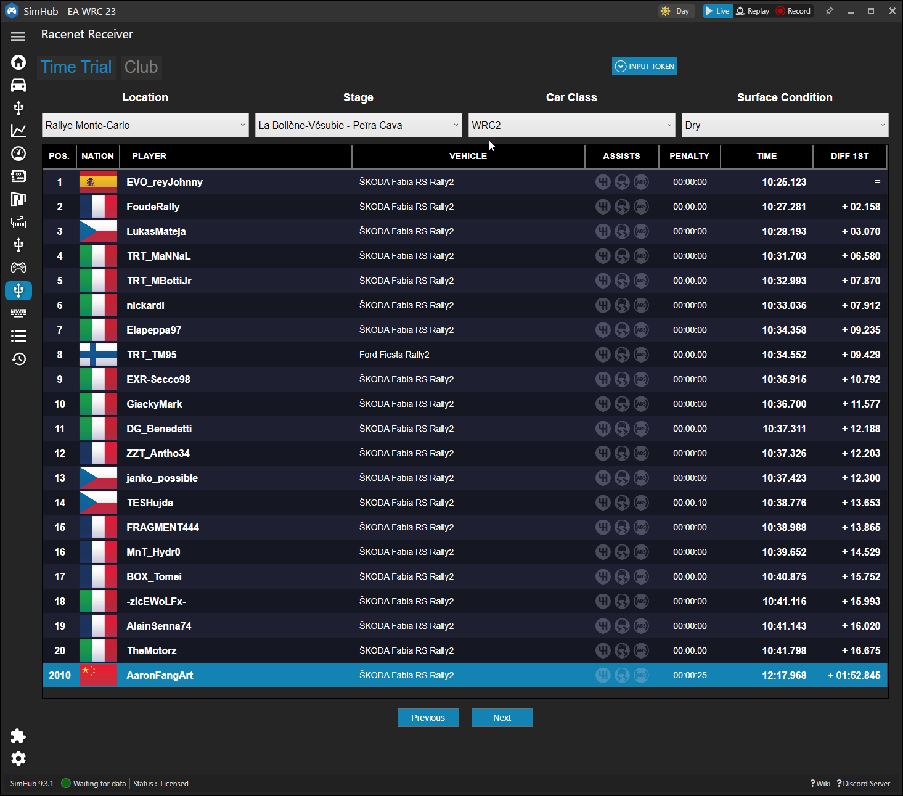
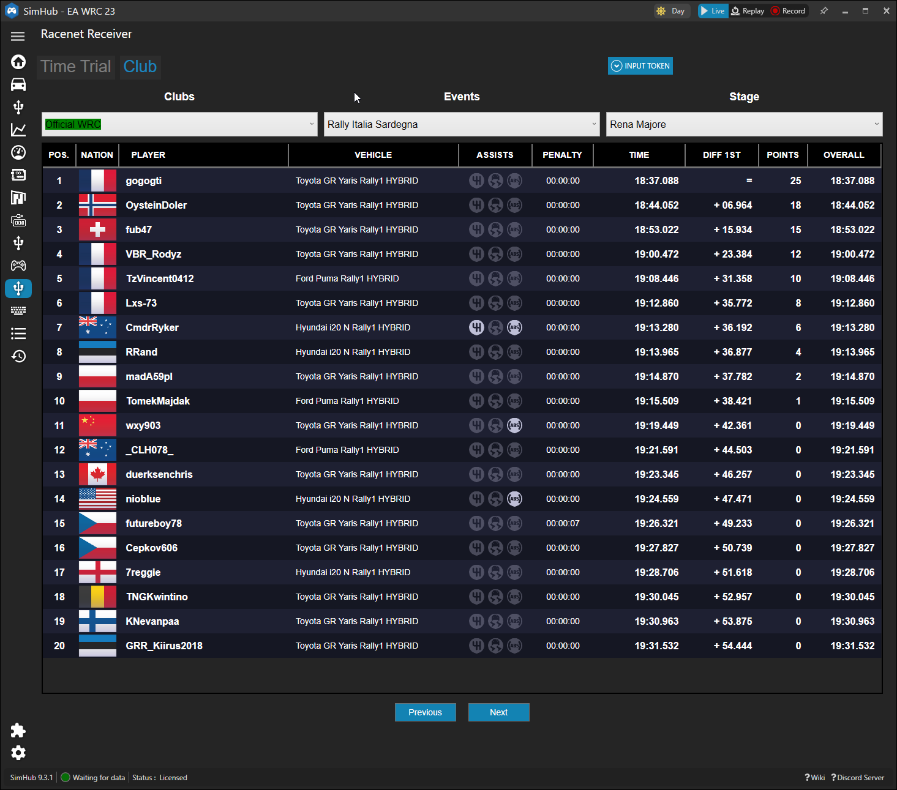
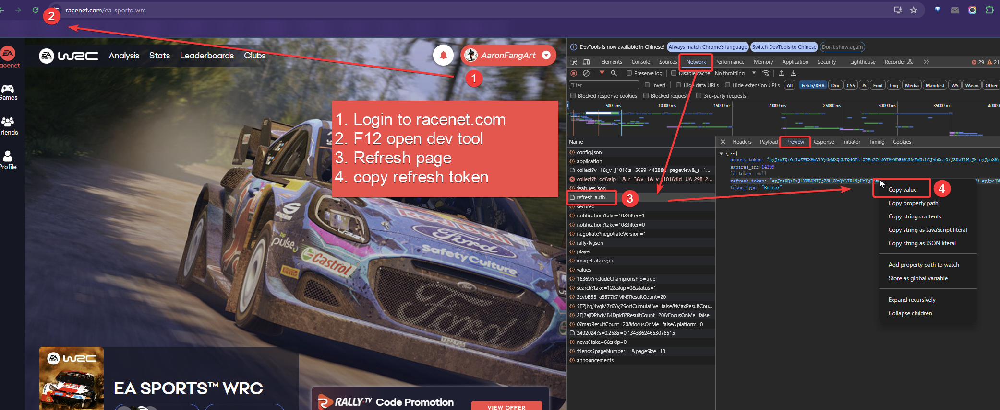

# Simhub-Plugin-RacenetReceiver
Get Time Trial and Club Learderboard data from Racenet.com for **EA WRC 23**. You can then use these raw data to build your own dashboard or overlay.

> - This plugin is only tested on EA WRC 23, so it may not work on other games.  
> - This plugin is still in the early stages of development, so there might be bugs here and there. I highly recommend turning on the logging page of SimHub. It makes it easy to check if there are any errors.  
> - If you have any questions or suggestions, feel free to bring them up in the issue section.  

time trial leaderboard  
  

club leaderboard  
  

### Installation:
1. Make sure you have installed latest version [SimHub](https://www.simhubdash.com/) on your PC.
2. Download the latest release from [here](https://github.com/aaronfang/Simhub-Plugin-RacenetReceiver/releases/tag/1.0.0)
3. Extract the .dll file to the `SimHub\` root folder.
4. Launch SimHub, go to `Add/remove features` -> `Plugins`, enable `Racenet Receiver` plugin.

### How to use:
1. Go to Tab `Racenet Receiver` in SimHub, Chlick `INPUT TOKEN` button to open the input dialog.
2. Get your `refresh token` from `Racenet.com`  
    a. open racenet.com in browser  
    b. login with your EA account  
    c. open developer tools in browser (clrt+shift+i in chrome, firefox, etc.)  
    d. copy the `refresh_token`

    > Usually, refresh_token doesn't expire. However, if you haven't used the plugin for a long time, there's a chance that the refresh_token might become invalid. In that case, you'll need to get a new refresh_token.
 
  

3. Paste the `refresh_token` to the input dialog, click `OK` to connect to racenet.com.  

4. Now you will be able to see the time trial leaderboard and club leaderboard in the plugin tab.  
    a. Click `Time Trial` tab to get the time trial leaderboard data.  
    b. Click `Club` tab to get the club leaderboard data.  

5. Following properties are added to the `Available properties` tab, you can use these raw data from racenet in the dashboard editor.  

    `RacenetDataReceiver.Racenet.rawData.clubChampionshipInfo`  
    > Championship/Events list for current club.  

    `RacenetDataReceiver.Racenet.rawData.clubLeaderboardCurrentStage`  
    > Current stage leaderboard for current club.  

    `RacenetDataReceiver.Racenet.rawData.clubListData`   
    > All the clubs you have joined.  

    `RacenetDataReceiver.Racenet.rawData.currentClubName`  
    > Current club name you have selected in the Club tab.  

    `RacenetDataReceiver.Racenet.rawData.currentClubWeatherAndSurface`  
    > Current club weather and surface condition.  

    `RacenetDataReceiver.Racenet.rawData.leaderboard.dry`  
    > Time trial leaderboard for DRY condition of current stage.  

    `RacenetDataReceiver.Racenet.rawData.leaderboard.wet`  
    > Time trial leaderboard for WET condition of current stage.  

    `RacenetDataReceiver.Racenet.rawData.nationalityID`  
    > The correspondence between nationality ID and contry flag png.  

    `RacenetDataReceiver.Racenet.rawData.personalInfo`  
    > Player's personal info.  

    `RacenetDataReceiver.Racenet.rawData.timeTrialPreInfo`  
    > Such as location name/id, route name/id, vehicle/vehicleClass id, etc.  

### Next Steps:
- [x] Code as SimHub plugin
- [x] Add GUI for the to handle login and club selection
- [ ] Add support for more telemetry data on racenet, such as delta time / split time for other players, etc
- [ ] Add support for more games on Racenet.com, such as Dirt Rally 2.0, etc